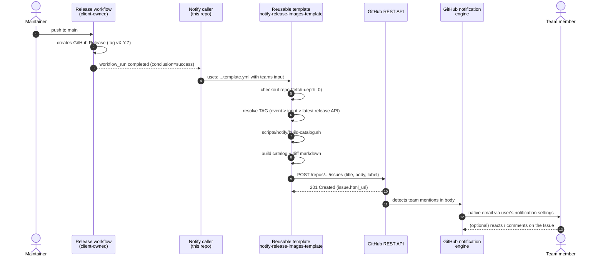

# Event flow

What happens between the moment someone publishes a release in
`container-utils` and the email arriving in the developer's inbox.

## Diagram

## Steps in text

### 1. Trigger

Two possible entry points:

- **Automatic**: the client's release workflow finishes on `main`. GitHub emits
  a `workflow_run` event with `conclusion: success`. The caller's job runs only
  in that case (`if: github.event.workflow_run.conclusion == 'success'`).
- **Manual (test)**: someone runs `gh workflow run notify-release-images.yml -f tag=v0.0.0-test`
  or uses the UI **Actions -> Run workflow**. Emits `workflow_dispatch`.

Both paths land in the same `call` job that invokes the reusable template.

### 2. Reusable template invocation

The caller passes three inputs:

- `teams` (required): multiline string, one mention per line
- `issue_label` (optional): defaults to `release-notification`
- `tag` (optional): only set for manual test dispatch; empty otherwise

The template runs on `ubuntu-latest`, checks out the repo with full history
(needed for the tag diff), and executes the steps below.

### 3. Tag resolution

Priority chain:

1. Explicit `inputs.tag` -- highest priority, used in manual dispatch
2. `github.event.release.tag_name` -- present only for native `release` events
3. Latest release fetched via `gh release view --json tagName --jq .tagName`

If none of these yields a value, the step fails with a clear message.

The resolved tag is validated against `^[a-zA-Z0-9._+-]+$` before being exported
to `$GITHUB_ENV`. This prevents shell injection via a maliciously named tag.

### 4. Catalog + diff

`scripts/notify/build-catalog.sh` runs and emits markdown to stdout, redirected
into `release-catalog.md`. Uses helpers from `scripts/notify/lib.sh`:

- `list_dockerfiles()`: `find . -type f -name 'Dockerfile*' -not -path './.git/*' | sort`
- `extract_last_from()`: the final FROM line (image devs consume)
- `parse_ref()`: splits `image[:tag][@digest]` into three fields
- `resolve_prev_tag()`: previous git tag by creation date

The script emits two sections:

1. **Catalog**: current state of every stack
2. **Changes since**: comparison against `PREV_TAG`; each row is `unchanged`,
   `**YES**`, or `NEW`

The markdown is also appended to `$GITHUB_STEP_SUMMARY` so the maintainer sees
it on the run page without opening the Issue.

### 5. Issue creation

`actions/github-script@v7` runs JavaScript on the runner:

1. Read the resolved `TAG` from env
2. Resolve `releaseUrl` -- prefer event payload, fall back to API lookup, then
   to `.../releases/tag/<TAG>` string
3. Parse the `teams` env into an array (splits on newline, keeps `@`-prefixed entries)
4. Compute a UTC timestamp: `YYYY-MM-DD HH:MM UTC`
5. Assemble the body: mentions, headline with the tag, timestamp, release URL,
   short explanatory blockquote, catalog markdown, footer
6. Ensure the `release-notification` label exists (create if 404)
7. `POST /repos/.../issues` with title, body, label

### 6. GitHub's notification engine

This is where the "native email" happens:

- GitHub parses the Issue body for `@ORG/team-name` patterns
- For each detected team, it resolves the members and enqueues notifications
- For each member:
  - Checks the user's notification preferences at `settings/notifications`
  - If the user accepts email for `@mentions`, sends via `notifications@github.com`
    to the user's preferred verified email
  - Also registers the item in the GitHub Inbox

**Critical**: if the token that created the Issue cannot "see" the team members
(typical of the default `GITHUB_TOKEN`), the mention renders as a link but
**no notification fires**. That is why production uses a GitHub App with
`Members: Read`.

### 7. Developer receives the notification

- Email subject: `[welbsterhansi/container-utils] Release vX.Y.Z - base images available (#123)`
- Body contains the tables and the explanatory blockquote
- Replying to the email posts a comment on the Issue

## What this flow does NOT do (and why)

| Does not | Reason |
|---|---|
| Use our own SMTP | Bank does not allow it; GitHub's notification engine is used instead |
| Use outbound webhooks | Bank approval cycle is too slow |
| Trigger on plain `push` to main | Would fire on every commit, not only when a release was created |
| Trigger on `release: published` alone | Default `GITHUB_TOKEN` used by upstream release action does not fire it |
| Close previous Issues | Announcement history stays; devs filter by `release-notification` label |
| Use Discussions | Team mentions from bot are less reliable in Discussions than in Issues |
| Depend on non-official actions | Only `actions/*` (checkout, github-script, create-github-app-token) |

## Failure modes

| Point | Visible symptom | Where to look |
|---|---|---|
| Upstream workflow name mismatch | `workflow_run` never fires | `on: workflow_run: workflows:` value in caller |
| Upstream workflow failed | `if:` guard blocks the call | UI shows the caller skipped |
| Tag cannot be resolved | Step "Resolve release tag" fails | Log message points to which fallback was hit |
| Tag has bad characters | Regex validation fails | Rename the tag |
| Catalog is empty | Zero rows in the table | Verify Dockerfiles exist at repo root |
| Issue not created (403/404) | `github-script` step errors | `permissions:` block on both caller and template |
| Issue created but no email | Members did not receive it | Switch from `GITHUB_TOKEN` to a GitHub App token |
| One dev did not receive | Only that dev | Their preferences at `settings/notifications` |
