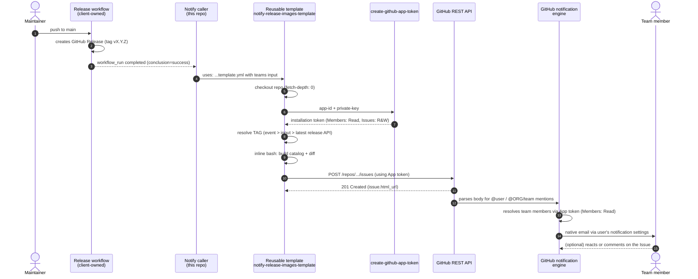

# Event flow

What happens between the moment someone publishes a release in
`container-utils` and the email arriving in the developer's inbox.

## Diagram

## Steps in text

### 1. Trigger

Two possible entry points:

- **Automatic**: the client's release workflow finishes on `main`. GitHub
  emits a `workflow_run` event with `conclusion: success`. The caller's
  job runs only in that case
  (`if: workflow_run.conclusion == 'success'`).
- **Manual (test)**: `gh workflow run notify-release-images.yml -f tag=v0.0.0-test`
  or the UI **Actions -> Run workflow**. Emits `workflow_dispatch`.

Both paths invoke the reusable template.

### 2. Template invocation and App token

The caller passes `teams`, optional `issue_label` and `tag`, plus
`secrets: inherit`. The template runs on `ubuntu-latest`, checks out the
repo with full history, then generates a GitHub App installation token
via `actions/create-github-app-token@v3` using:

- `app-id: ${{ secrets.NOTIFY_APP_ID }}`
- `private-key: ${{ secrets.NOTIFY_APP_PRIVATE_KEY }}`

That token is used by every subsequent API call. `GITHUB_TOKEN` is
**not used** in the notification path because it cannot resolve team
members for mention notifications.

### 3. Tag resolution

Priority chain (inline bash):

1. Explicit `inputs.tag` -- manual dispatch
2. `github.event.release.tag_name` -- native release event
3. Latest release fetched via `gh release view --json tagName --jq .tagName`

The resolved tag is validated against `^[a-zA-Z0-9._+-]+$` before being
exported to `$GITHUB_ENV`. This prevents shell injection.

### 4. Catalog + diff (inline bash)

All logic lives in the template's `Build catalog + diff` step. No
external scripts. The bash section defines three helpers:

- `list_dockerfiles()`: `find . -type f -name 'Dockerfile*' -not -path './.git/*'`
- `extract_last_from()`: the last FROM line (final image in multi-stage)
- `parse_ref()`: splits `image[:tag][@digest]` into three fields
  (handles `registry:port/path:tag` correctly)

Then it emits two markdown sections:

1. **Catalog**: current state of every stack
2. **Changes since**: comparison against the previous git tag; each row
   is `unchanged`, `**YES**`, or `NEW`

The markdown also goes to `$GITHUB_STEP_SUMMARY`.

### 5. Issue creation

`actions/github-script@v7` with `github-token: ${{ steps.app-token.outputs.token }}`:

1. Reads the resolved `TAG` from env
2. Resolves the release URL (event payload -> API lookup -> tag URL fallback)
3. Parses `teams` env, keeping entries that start with `@`
4. Computes a UTC timestamp: `YYYY-MM-DD HH:MM UTC`
5. Assembles the body: mentions, headline with the tag, timestamp,
   release URL, short explanatory blockquote, catalog markdown, footer
6. Ensures the `release-notification` label exists
7. `POST /repos/.../issues`

### 6. GitHub's notification engine

- GitHub parses the Issue body for `@user` and `@ORG/team-name` patterns
- For each team, GitHub uses **the App's `Members: Read` permission** to
  resolve members and enqueue notifications
- For each member:
  - Checks preferences at `settings/notifications`
  - If the user accepts email for `@mentions`, sends via
    `notifications@github.com` to their preferred verified email
  - Also registers the item in the GitHub Inbox

**Critical**: without a token that can see team members, the mention
renders but **no notification fires**. That is why the App with
`Members: Read` is mandatory.

### 7. Developer receives the notification

- Email subject: `[<org>/container-utils] Release vX.Y.Z - base images available (#123)`
- Body contains the tables and the explanatory blockquote
- Replying to the email posts a comment on the Issue

## What this flow does NOT do (and why)

| Does not | Reason |
|---|---|
| Use our own SMTP | Bank does not allow it; GitHub delivers |
| Use outbound webhooks | Bank approval cycle is too slow |
| Trigger on plain `push` to main | Would fire on every commit, not only when a release was created |
| Trigger on `release: published` alone | Default `GITHUB_TOKEN` in upstream workflow does not fire it |
| Use `GITHUB_TOKEN` for the Issue | Cannot resolve team members -> emails would not send |
| Accept bare `@user` mentions | Forces discipline: notifications go through teams (auditable, maintainable) |
| Use Discussions | Team mentions from bot are less reliable in Discussions than in Issues |
| Depend on non-official actions | Only `actions/*` (checkout, github-script, create-github-app-token) |
| Use external scripts | Everything inline in the template for portability |

## Failure modes

| Point | Visible symptom | Where to look |
|---|---|---|
| Upstream workflow name mismatch | `workflow_run` never fires | `on: workflow_run: workflows:` in caller |
| Upstream failed | `if:` guard blocks the call | UI shows the caller as skipped |
| App vars/secrets missing | Step `Generate GitHub App token` fails | README section 2 |
| Tag cannot be resolved | Step `Resolve release tag` fails | Log shows which fallback was hit |
| Tag has bad characters | Regex validation fails | Rename the tag |
| Catalog is empty | Zero rows in the table | Verify `Dockerfile*` exist at repo root |
| Issue creation 403/404 | `Create announcement Issue` errors | App permissions or repo installation |
| `has no valid mentions` | Teams input rejected | Use `@user` or `@ORG/team` |
| Team mention renders as plain text | App lacks `Members: Read` or team is `privacy=secret` | Fix App or `gh api -X PATCH .../teams/<team> -f privacy=closed` |
| One dev did not receive | Only that dev | Preferences at `settings/notifications` |
