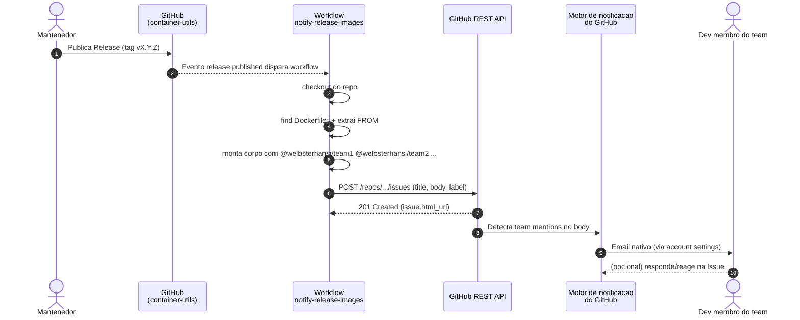

# Fluxo de notificacao

Explicacao do que acontece do momento em que alguem publica uma release em
`container-utils` ate o e-mail chegar no dev.

## Diagrama



## Etapas em texto

### 1. Trigger

Dois caminhos possiveis chegam no workflow:

- **Automatico**: alguem publica uma Release na aba `Releases` do repo.
  GitHub dispara o evento `release: published`.
- **Manual (teste)**: alguem roda `gh workflow run notify-release-images.yml
  -f tag=v0.0.0-test` ou usa a UI **Actions -> Run workflow**. Dispara o
  evento `workflow_dispatch` com um input `tag`.

Ambos caem no mesmo job. O codigo detecta a origem via:

```js
const tag = context.payload.release?.tag_name       // caminho automatico
         || context.payload.inputs?.tag              // caminho manual
         || 'v0.0.0-test';                           // fallback
```

### 2. Coleta do catalogo + diff

Este passo tem duas partes: catalogo atual e diff contra release anterior.

#### 2.1. Resolucao de tags

- `TAG` = tag da release publicada (ou input do `workflow_dispatch`).
  Validada com regex `^[a-zA-Z0-9._+-]+$` antes de qualquer uso em shell.
- `PREV_TAG` = tag imediatamente anterior:
  - Se `TAG` ja existe no git (evento `release`): `git tag --sort=-creatordate`
    excluindo `TAG`, primeira linha.
  - Se `TAG` nao existe ainda (teste manual): a tag mais recente do repo.

Se o repo nao tem nenhuma tag anterior, a secao de diff e omitida com
`_Primeira release do repo: sem tag anterior para comparar._`.

#### 2.2. Catalogo atual

Um step bash roda `find . -type f -name 'Dockerfile*' -not -path './.git/*'`.
Para cada Dockerfile:

1. Deriva o `stack` do diretorio pai (`microservices-deployment-openjdk21`, etc).
2. Extrai a **ultima** linha `FROM` (imagem final em builds multi-stage).
3. Remove `AS <alias>` do final, se houver.
4. Chama `parse_ref()` que quebra `image:tag@digest` em tres colunas.
   Cobre casos complicados como `localhost:5000/svc:v2` (o `:` da porta
   nao pode confundir com o `:` da tag).
5. Escreve linha na tabela `| Stack | Imagem | Tag | Digest |`.

#### 2.3. Diff contra `PREV_TAG`

Para cada Dockerfile, o step le o conteudo no HEAD e o conteudo em
`git show $PREV_TAG:caminho/Dockerfile`, extrai a tag de cada um e emite:

- `sem mudanca` se as strings sao iguais
- `**SIM**` se qualquer parte mudou (imagem, tag ou digest)
- `NOVO` se o Dockerfile nao existia em `PREV_TAG`

O catalogo completo tambem vai pro `$GITHUB_STEP_SUMMARY`, entao o
mantenedor ve o resultado na propria pagina do run sem abrir a Issue.

### 3. Criacao da Issue

Um step `actions/github-script@v7` roda JavaScript no runner:

1. Le `release-catalog.md`.
2. Le a lista de times de `env.TEAMS` (multiline string), quebra por linha,
   filtra vazios, valida que comecam com `@`.
3. Monta o corpo da Issue no formato:
   ```
   @welbsterhansi/team1 @welbsterhansi/team2 @welbsterhansi/team3
   
   Nova release publicada em welbsterhansi/container-utils: vX.Y.Z
   
   Release notes: https://github.com/welbsterhansi/container-utils/releases/tag/vX.Y.Z
   
   ## Catalogo de imagens base publicadas
   | Stack | Dockerfile | Imagem base (FROM) |
   |---|---|---|
   | microservices-deployment-openjdk21 | ... | registry.access.redhat.com/... |
   ...
   ```
4. Garante que a label `release-notification` existe (cria se nao).
5. `POST /repos/.../issues` com `title`, `body`, `labels: [release-notification]`.

### 4. Motor de notificacao do GitHub

Aqui e onde o "e-mail nativo" acontece, e e a parte que vale entender bem:

- GitHub parseia o corpo da Issue procurando padroes `@welbsterhansi/team-name`.
- Para cada team detectado, resolve os membros e enfileira notificacoes.
- Para cada membro:
  - Verifica preferencia de notificacao do usuario (`settings/notifications`)
  - Se o usuario aceita "email para mentions", envia via
    `notifications@github.com` para o e-mail primario/preferido do perfil.
  - Registra tambem em Inbox de notificacoes do GitHub.

**Importante**: se o token que criou a Issue nao consegue "ver" os membros
do team (typico do `GITHUB_TOKEN` padrao), a mention pode ser renderizada
como link mas **nao dispara notificacao**. Por isso o setup em prod usa uma
GitHub App com permissao `Members: Read`.

### 5. Recepcao pelo dev

- Recebe e-mail com assunto tipo:
  `[welbsterhansi/container-utils] Release vX.Y.Z - novas imagens base disponiveis (#123)`
- Corpo do e-mail contem a tabela de imagens.
- Se responder ao e-mail, comentario cai na Issue.

## O que este fluxo NAO faz (e por que)

| Nao faz | Motivo |
|---|---|
| Nao usa SMTP proprio | Banco nao libera; usamos motor nativo do GitHub |
| Nao usa webhook | Banco nao libera aprovacao em tempo habil |
| Nao envia diff entre releases | v1 mostra catalogo completo; diff e evolucao |
| Nao fecha Issue anterior | Historico de anuncios permanece; devs filtram por label |
| Nao usa Discussions | Team mention por bot e menos confiavel em Discussion |
| Nao depende de action de marketplace nao-oficial | Apenas `actions/*` (oficial) |

## Pontos de falha e como cada um se manifesta

| Ponto | Falha visivel | Onde investigar |
|---|---|---|
| Trigger nao disparou | Nenhum run em Actions | Config de `on:` no workflow, permissoes de release |
| Checkout falhou | Run vermelho no step 1 | Log do step "Checkout" |
| Catalogo vazio | Tabela sem linhas | Existem `Dockerfile*` no repo? Log do step "Monta catalogo" |
| Issue nao criada | Erro 403/404 no step github-script | Verificar `permissions: issues: write` |
| Issue criada mas sem notif | Devs nao recebem e-mail | Trocar `GITHUB_TOKEN` por App token |
| Dev especifico nao recebe | So um nao recebe | Preferencias em `settings/notifications` desse dev |
